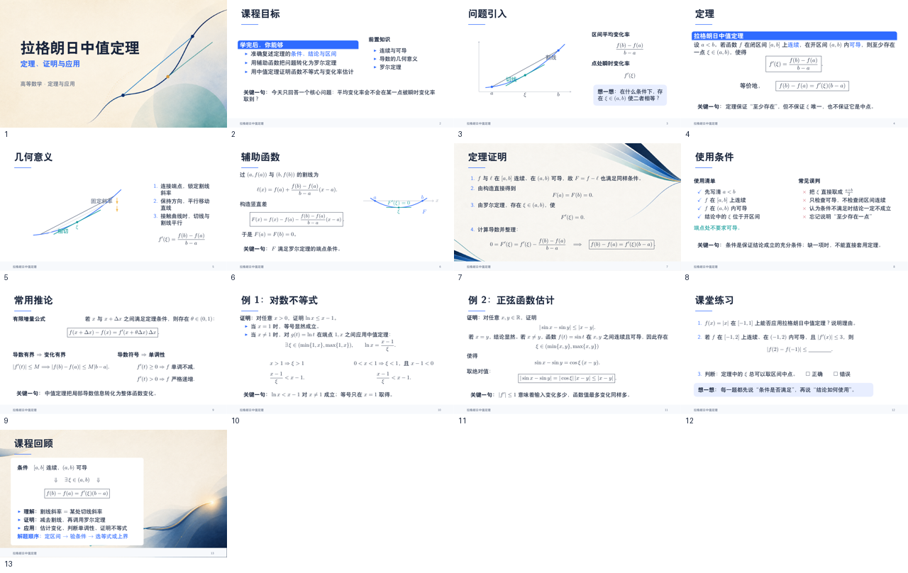

# Build Lesson Slides

面向 Codex 的教学课件 Skill：根据学科、对象、知识点和课时，生成简洁的 16:9 LaTeX Beamer PDF、同步讲稿、逐页预览和可点击元素映射。



## 功能

- 支持数学、物理、化学、生物、语文、英语、历史、地理、计算机等学科。
- 按“学科英文名/知识点”组织课程文件、缓存和最终产物。
- 同步生成 `speaker-notes.md`，并检查讲稿与 PDF 页码一一对应。
- 使用 LaTeX、TikZ、PGFPlots 表达公式、图形和精确标注。
- 自动执行两遍编译、16:9 检查、逐页渲染和版面质量检查。
- 通过 `lesson-elements.json` 保存公式、文本与 PDF 点击区域的对应关系。

## 安装

在需要使用该 Skill 的工作目录中运行：

```powershell
npx.cmd -y skills add https://github.com/pang-cream/build-lesson-slides.git --skill build-lesson-slides --agent codex
```

仓库已通过上述 Codex 项目级导入方式验证。在本仓库根目录开发或测试时，可先检查本机环境：

```powershell
python scripts\doctor.py --create-venv --write --image-tool available
```

需要 Python 3、XeLaTeX，以及提供 `pdfinfo` 和 `pdftoppm` 的 Poppler。脚本不会静默安装系统软件。

## 使用

在 Codex 中调用 `$build-lesson-slides`，并说明学科、对象、知识点、时长、页数和输出目录。例如：

```text
使用 $build-lesson-slides，为大学一年级学生制作一套 25 分钟的
“拉格朗日中值定理”中文教学课件，输出 16:9 Beamer PDF 和同步讲稿。
```

每门课程默认生成：

```text
<workspace>/<subject>/<topic>/
├── lesson.tex
├── lesson-theme.sty
├── lesson.pdf
├── lesson-elements.json
├── speaker-notes.md
├── assets/
└── previews/
```

## 构建与验证

```powershell
python scripts\build.py <course>\lesson.tex `
  --notes <course>\speaker-notes.md `
  --elements <course>\lesson-elements.json `
  --output-dir <course>
```

生成预览总览图：

```powershell
python scripts\contact_sheet.py <course>\previews <course>\previews\contact-sheet.png
```

脚本自检：

```powershell
python scripts\doctor.py --self-test
python scripts\build.py --self-test
python scripts\contact_sheet.py --self-test
```

## 点击区域映射

课件中的可提问公式或文本由 `\LessonElement{id}{content}` 包裹。PDF 内会生成 `lesson://element/<id>` 链接注解，前端可读取注解矩形，再使用 `lesson-elements.json` 还原对应的原始 LaTeX 或文本。

## 示例

仓库中的 [`test`](test) 目录包含 13 页“拉格朗日中值定理”课件、同步讲稿、背景素材、PDF 和预览总览图。

## License

[MIT](LICENSE)
